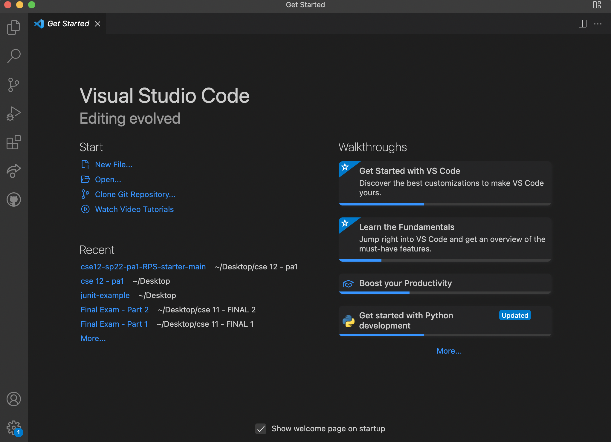
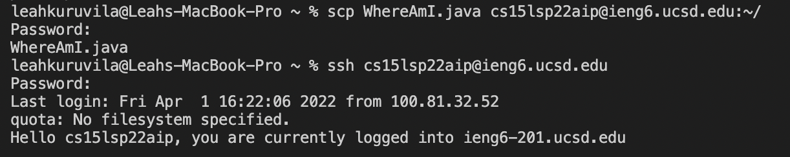
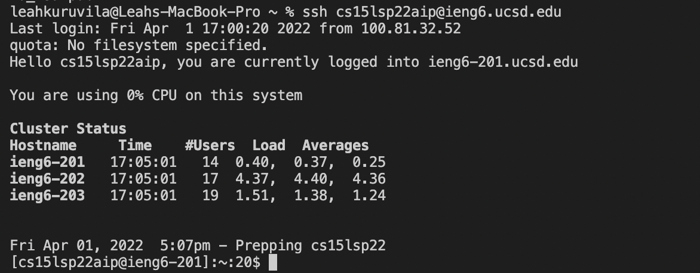
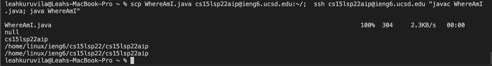

# Tutorial on How to Log Into a Course Specific Account


1. **Installing VScode**
    * to install vs code first go to the VScode website and download it to your computer
    * once it is downloaded you can open it as an application on your computer
    * when you open vs code it should look like this :
    


2. **Remotely Connecting**
    * first look up your course-specific account
    * open a terminal in VSCode
    * type in the command ssh followed by your account name
    * if it asks "Are you sure you want to continue connecting (yes/no/\[fingerprint])?", type yes and enter your password 
    * it should look like this once you press enter on the ssh command:


3. **Trying Some Commands:**
    * here are a list of commands you can try:

        1. ```cd```

        2. ```cd ~```
        3. ```cd```
        4. ```ls -lat```
        5. ```ls -a```
        6.  ```ls \<directory> where \<directory> is /home/linux/ieng6/cs15lsp22/cs15lsp22abc``` , where the abc is one of the other group members’ username
        7. ```cp /home/linux/ieng6/cs15lsp22/public/hello.txt ~/```
        8. ```cat /home/linux/ieng6/cs15lsp22/public/hello.txt```

    * here is an example of trying the ls \<directory> command:

        

      

4. **Moving Files with scp**
    * the command scp allows us to copy files back and forth between the computers
    * we will always run it from the client (that means from your computer, not logged into course specific account)

        1. first create a file on your computer
        2. run it using javac and java on your computer
        3. run this command:

            ```scp <file_name.java> <account_name>:~/```
        4. then enter your password for your account
        5. once you log back into your account with ssh you should see the file has been copied when you use the **ls** command to check the contents of the directory 
    * this is how it should look like:
    


  
 

 5. **Setting an SSH Key**

    * a program, called ssh-keygen, creates a pair of files called the public key and private key. 
    * now we can copy the public key to a particular location on the server, and the private key in a particular location on the client. 
    * Then when we use ssh command the pair of files can be used in place of your password, saving you from entering your password everytime.

        1. start by exiting out of the course specific count and running this command on your client (computer)

            ``` % ssh-keygen```

        2. then enter a file to save the key

            ```(/Users/\<user-name>/.ssh/id_rsa): /Users \<user-name>/.ssh/id_rsa```
        3. do not enter a passphrase when prompted with:

                Enter passphrase (empty for no passphrase): 

    * This created two new files on your system; the private key (in a file id_rsa) and the public key (in a file id_rsa.pub), stored in the .ssh directory on your computer
    * Now we need to copy the public (not the private) key to the .ssh directory of your user account on the server
    
        1. 
            ```ssh <account_name>```
        2. enter password 
        3.  ```mkdir .ssh```
        4. now type ```"exit"``` in the terminal to logout

            ```exit```
        5. ```scp /Users/<user-name>/.ssh/id_rsa.pub cs15lsp22zz@ieng6.ucsd.edu:~/.ssh/authorized_keys```

    * now you can ssh or scp from this client to the server without entering your password
    * here is what it should look like when logging in: 
    


6. **Optimizing Remote Running**
    * this command will log in and list the home directory on the remote server:

        ```ssh cs15lsp22zz@ieng6.ucsd.edu "ls"```
    * to run multiple commands on the same line in most terminal do:

         ```cp <file1_name>.java <file2_name>; javac <file2_name>.java; java <file1_name>```
    * You can use the up-arrow on your keyboard to recall the last command that was run
    * here is an example of using multiple commands:

        

<br/><br/>
**Thank your for using my tutorial!!**


