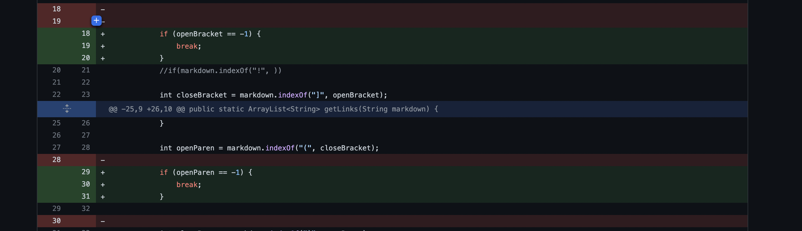
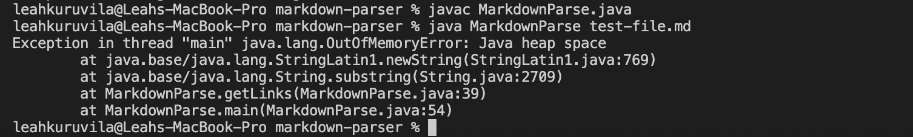
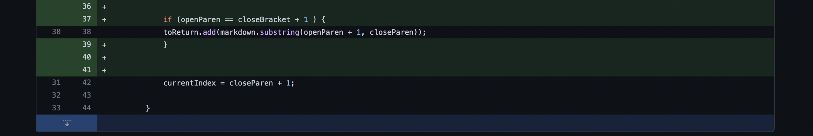
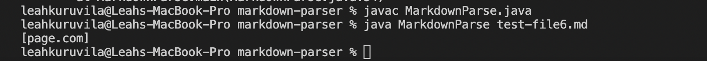
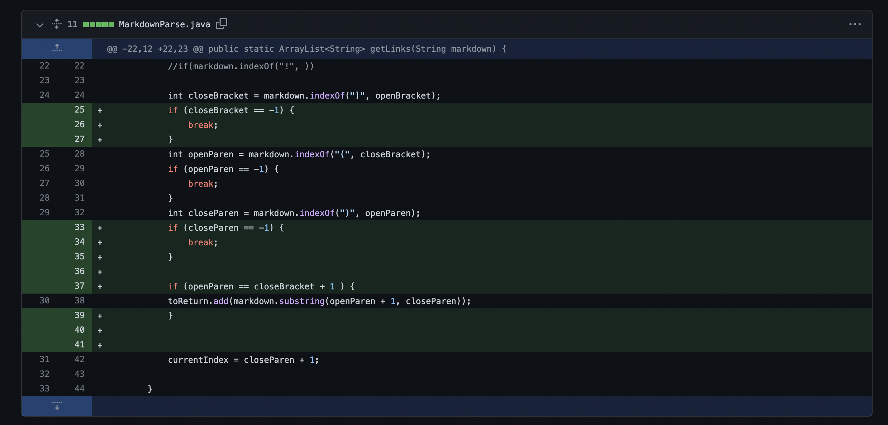

# Lab Report Week 2

## My three code changes to fix a big
1. an infinite loop caused by an extra line
2. adding text in paranthesis without brackets in front it of it as a link to the array
3. an infinite loop caused by an added line with a singular open bracket

## code change 1: infinite loop due to extra line

    screenshot of the code change diff from Github: 

    
[Link to the test file for a failure-inducing input that prompted me to make that change](https://github.com/leahkuruvila/markdown-parser/blob/main/test-file.md)

    the output of running the file at the command line for the version where it was failing: 

**Description of the relationship between the bug, the symptom, and the failure-inducing input.**

It is necesary that I add lines 18-20 to ensure that the program knows to stop looking for an open bracket. If there is no open brackets found the value of openBracket would be 1, so in that case I would need to break the while loop. I also added lines 29-31 since I realized there might be case when the open brackets were found and the program could not found an open paranthesis, so it would also need to break then(lines 29-31 did not have to be added to fix the bug).

## code change 2: adding text in paranthesis without brackets in front it of it as a link to the array

    screenshot of the code change diff from Github: 

[Link to the test file for a failure-inducing input that prompted me to make that change](https://github.com/leahkuruvila/markdown-parser/blob/main/test-file5.md)

    the output of running the file at the command line for the version where it was failing: 

**Description of the relationship between the bug, the symptom, and the failure-inducing input.**

In test-file5.md, there was text within a set of parathesis, however, there were no brackets before the paranthesis, meaning it should not be considered a link. The text in the paranthesis printed as a link, so I needed to added an if statement to make sure there was a close bracket right before an open bracket in order to consider the text in parenthesis as a link. 

## code change 3: an infinite loop caused by an added line with a singular open bracket

    screenshot of the code change diff from Github: 

[Link to the test file for a failure-inducing input that prompted me to make that change](https://github.com/leahkuruvila/markdown-parser/blob/main/test-file8.md)

    the output of running the file at the command line for the version where it was failing:
     

**Description of the relationship between the bug, the symptom, and the failure-inducing input.**

Running the file test-file8.md caused an infinite loop because there was a singular open bracket, so the program kept looking for an a close bracket that was not there, resulting the program to never leave the while loop. In order to exit the while loop in the case that there is not a close bracket, I added lines 25-27, which breaks out of the for loop if that is the case. I also decided to added lines 33-37 as I realized that would take care of the case that the program could not find an a close paranthesis and would run an infnite loop as a results(lines 33-37 did not have to be added to fix the bug).