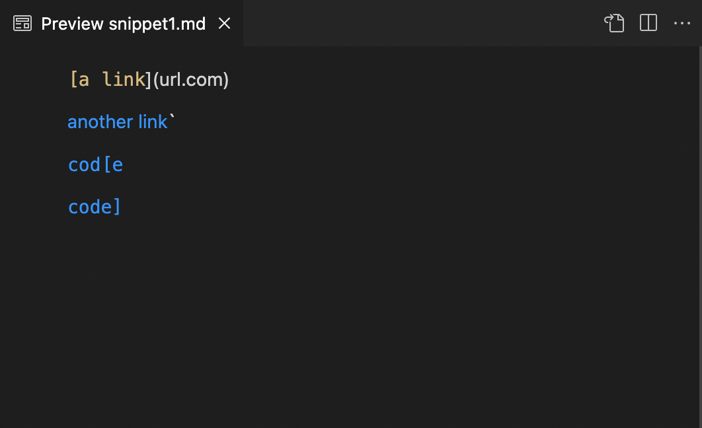
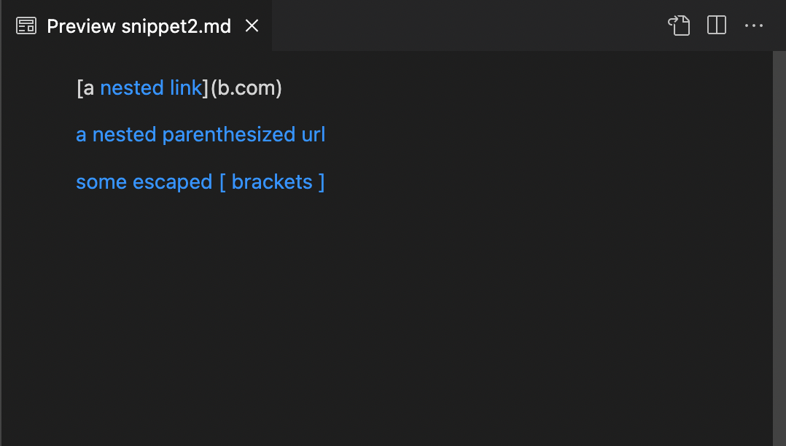
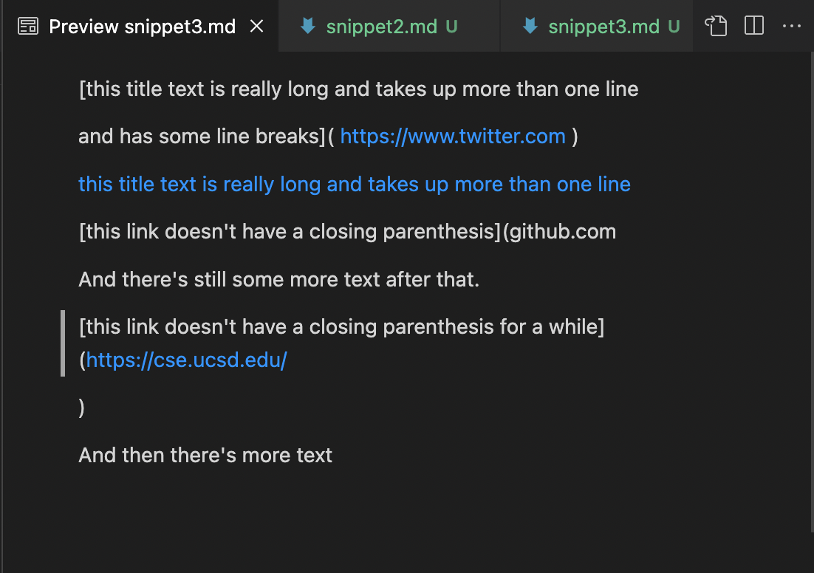
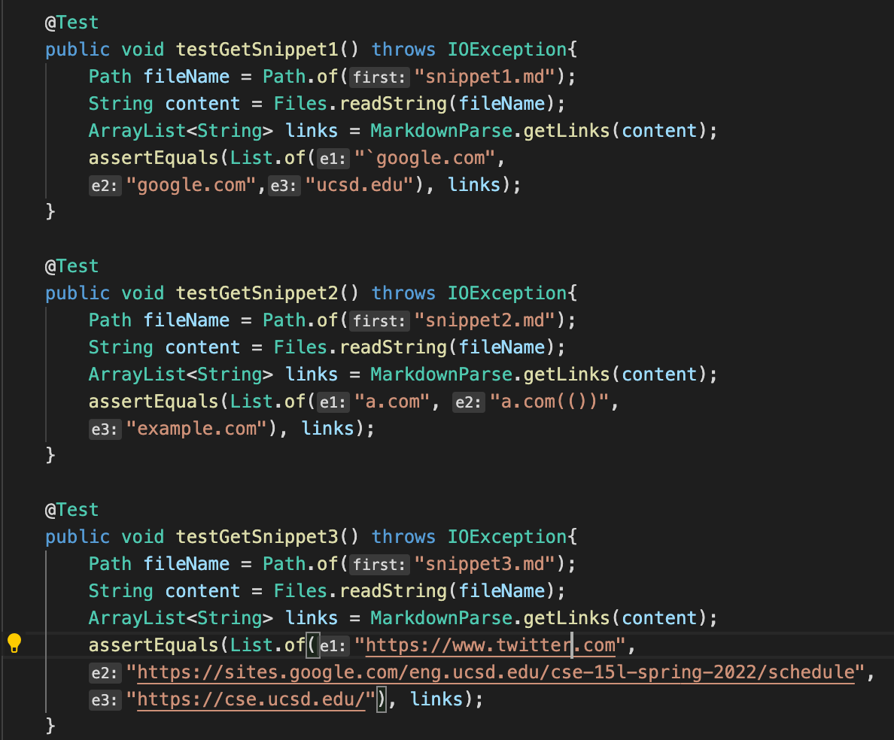
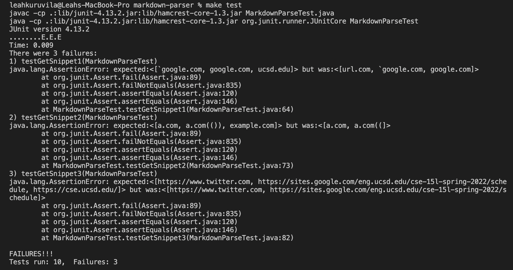
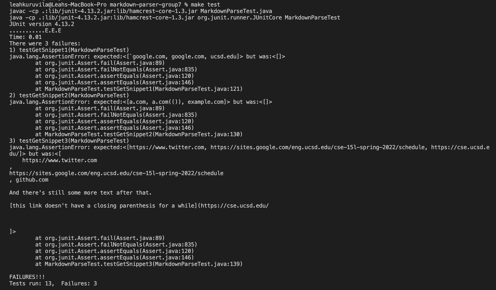

# Lab Report Week 6

[link to my markdown-parse repository](https://github.com/leahkuruvila/markdown-parser)

[link to the markdown-parse repository I reviewed in week 7](https://github.com/21KennethTran/markdown-parser)

## snippet expected output
1. snippet 1

- There are three valid links as indicated by the blue text:

    - another link -> "`google.com"
    - cod[e -> google.com
    - code] -> ucsd.edu
2. snippet 2

- There are three valid links as indicated by the blue text:

    - a.com
    - a.com(())
    - example.com
3. snippet 3

- There are three valid links as indicated by the blue text:

    - https://www.twitter.com
    - https://sites.google.com/eng.ucsd.edu/
    - https://cse.ucsd.edu/

## How I turned it into a test in MarkdownParseTest.java

**For my implementation**

**For the implementation I reviewed in Week 7**

## Questions

**Do you think there is a small (<10 lines) code change that will make your program work for snippet 1 and all related cases that use inline code with backticks? If yes, describe the code change. If not, describe why it would be a more involved change.**

I think a small change could make the program work in term of using inline code with backticks. Based on the cases in Snippet 1 I noticed that a link is only invalid when the first backtick exists right before the first bracket. However, if there is no second backtick, or the first backtick starts right after the first parenthesis, the link is still valid. So, I could add an if statement before adding the link to the ArrayList that checks if there is backtick before the open bracket on that line and if there is second backtick on that same line. If that is the case, I will not add the link to the ArrayList.

**Do you think there is a small (<10 lines) code change that will make your program work for snippet 2 and all related cases that nest parentheses, brackets, and escaped brackets? If yes, describe the code change. If not, describe why it would be a more involved change.**

I think a more involved change would be needed to fix all cases with nested brackets, paranthesis, and escaped brackets because I would need to keep track of which brackets are part of the link syntax and which are part of the inside characters and therfore should be ignored. I could do this by creating a stack that would allow me to determine which open brackets and paranthesis belong to the closed brackets and parenthesis. In additon, I would need to figure out if there is a nested link, because in that case, the outer link would not be a link and only the inner one would be, which is an extra case to consider.

**Do you think there is a small (<10 lines) code change that will make your program work for snippet 3 and all related cases that have newlines in brackets and parentheses? If yes, describe the code change. If not, describe why it would be a more involved change.**

I think a small change could make the program work since I think be keeping track where the open and closed brackets are, as well as the open and closed paranthesis I can esure that I am dealing with a link. I can do this by having the function continue to look for a closing bracket/paranthesis in the file to match their open counterpart on the next lines until there are no more lines to search, or an open bracket is found (indicating we are dealing with a new link). 

