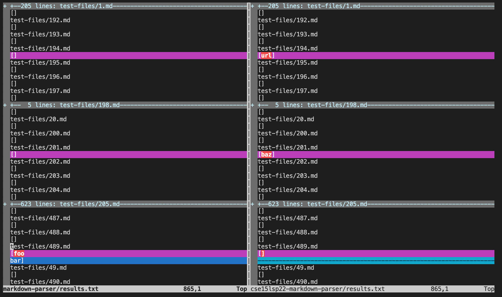
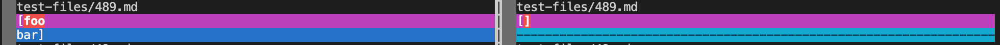
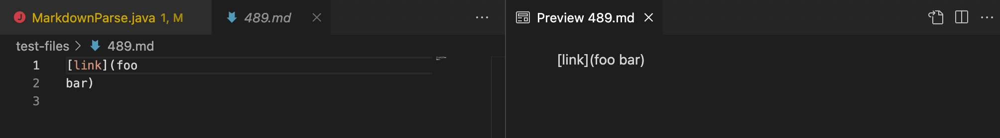

# Lab Report Week 10

**Explain:How you found the tests with different results:**

To find the tests with different results I used vimdiff on the results of running a bash for loop:

**Provide a link to the test-file with different-results:**

[link to the test-file with different-results](https://github.com/nidhidhamnani/markdown-parser/blob/main/test-files/489.html.test)

**For each test:**

For test 489.md it should have had no links as the link was split between lines. The other parser successfully gave no links, but ours ouputed [foo\nbar]

**Indicate both actual outputs and also what the expected output is**

actual outputs:

expected output:

**Decide on what it should produce** 

It should produce no links since the VScode preview shows that it was not recognized as a link.
